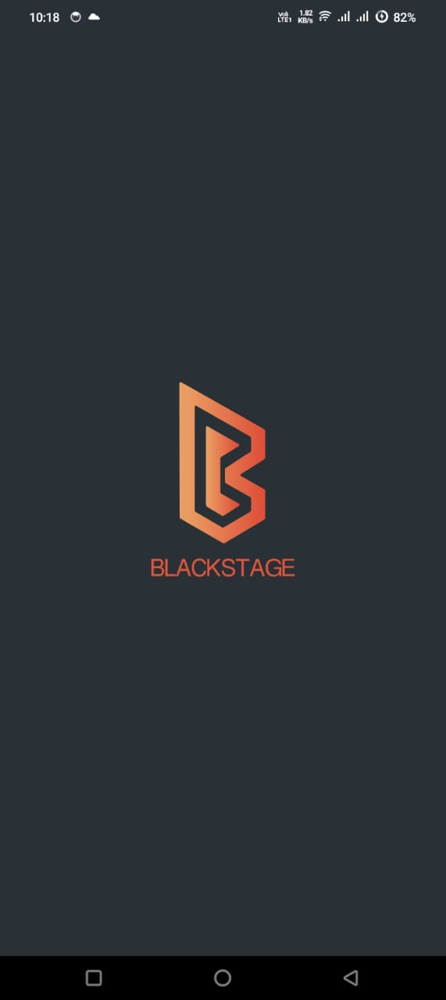
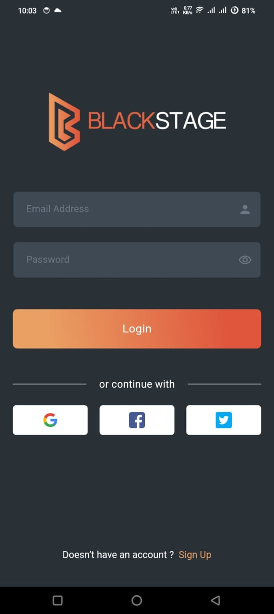
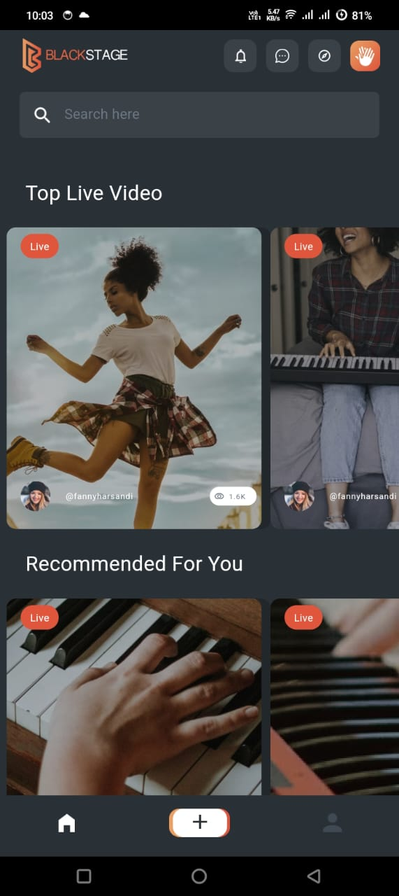

<div align="center">
  <h1>
    <br/>
    Black Stage
  </h1>
  <h3>A Feature-Rich Social Media & Live Streaming App</h3>
</div>

<p align="center">
    <a href="https://github.com/yourusername/black_stage" target="_blank">
        
    </a>
    <a href="https://www.linkedin.com/in/yourprofile/" target="_blank">
        
    </a>
</p>

## 📌 Overview

Black Stage is a Flutter application designed for live video streaming and user interaction. This project allows users to log in, view live videos, and interact with content.

## 🚀 Tech Stack

- **Flutter**
- **Firebase** (for authentication and data storage)
- **ZEGO Cloud** (for real-time streaming)

## 🔑 Key Features

- ✅ **Authentication**: Google, Twitter, and Facebook login integration
- ✅ **Live Streaming**: Implemented real-time streaming using ZEGO Cloud
- ✅ **Chat System**: Firebase-powered chat for seamless communication
- ✅ **Video Creation & Editing**: Built-in tools for content creation
- ✅ **User Profiles & Following System**: Enhanced social engagement
- ✅ **Wallet & Payment System**: Secure transactions for in-app purchases

## 📸 Screenshots

### Banner

.png>)

  <div style="display: grid; grid-template-columns: repeat(4, 1fr); gap: 10px; margin-bottom: 40px;">
    
    
    
  </div>

## 📁 Project Structure

```
black_stage/
├── android/ # Contains all Android-specific configurations and files
│ ├── app/ # The main application module
│ │ ├── build.gradle # Gradle build configuration for the app
│ │ └── ... # Other app-related files
│ ├── gradle/ # Gradle wrapper files
│ │ └── wrapper/ # Wrapper directory for Gradle
│ │ └── gradle-wrapper.properties # Properties for the Gradle wrapper
│ ├── build.gradle # Top-level Gradle configuration
│ └── gradle.properties # Gradle properties for the project
├── lib/ # Contains all Dart code for the application
│ ├── pages/ # Directory for different pages/screens
│ │ ├── user_profile_video_page.dart # User profile and video page implementation
│ │ └── ... # Other page files
│ └── main.dart # Entry point of the Flutter application
├── pubspec.yaml # Flutter package configuration file
└── README.md # Documentation for the project
```

## 💰 Monetization

The app includes a wallet and payment system that allows users to make secure transactions for in-app purchases. This feature enhances user engagement and provides a revenue stream for the application.


## 👨‍💻 Developer

Developed by [Jam Ali Hassan](https://github.com/jamalihassan0307)

---

<p align="center">
  Made with ❤️ using Flutter and Firebase
</p>
