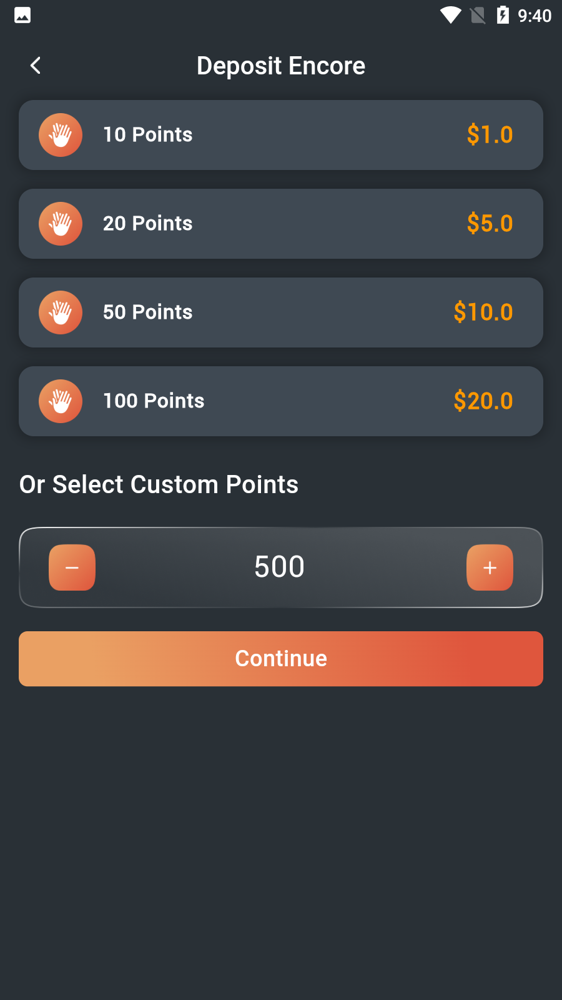
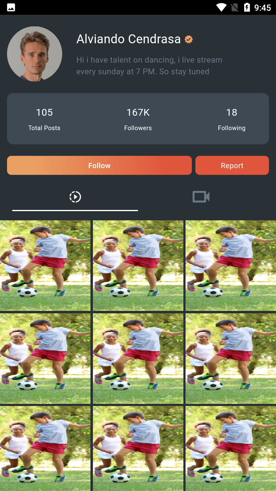

<div align="center">
  <h1>
    <br/>
    Black Stage - Social Media & Live Streaming App
  </h1>
  <h3>A Feature-Rich Social Media & Live Streaming Platform with Real-Time Video, Chat, and Wallet</h3>
</div>

<p align="center">
    
    
    
</p>

## 📸 Banner
<p align="center">
    
</p>

## 📌 Overview

Black Stage is a modern Flutter application for live video streaming, real-time chat, and social interaction. Users can log in with popular providers, join or host live streams, chat, manage profiles, and use a secure wallet for in-app purchases.

## 🚀 Tech Stack

- **Flutter** (UI Framework)
- **Firebase** (Authentication & Database)
- **ZEGO Cloud** (Real-Time Streaming)
- **Material Design**

## 🔑 Key Features

- ✅ **Authentication**: Google, Twitter, and Facebook login integration
- ✅ **Live Streaming**: Real-time video streaming with ZEGO Cloud
- ✅ **Chat System**: Firebase-powered chat for seamless communication
- ✅ **Video Creation & Editing**: Built-in tools for content creation
- ✅ **User Profiles & Following System**: Enhanced social engagement
- ✅ **Wallet & Payment System**: Secure transactions for in-app purchases
- ✅ **Face Beautification**: Real-time video effects

## 📸 Screenshots

### Onboarding & Login
<table border="1">
  <tr>
    <td align="center"><p><b>Splash</b></p></td>
    <td align="center"><p><b>Login</b></p></td>
    <td align="center"><p><b>Sign Up</b></p></td>
    <td align="center"><p><b>Google Sign In</b></p></td>
    <td align="center"><p><b>Facebook Login</b></p></td>
  </tr>
</table>

### Home & Audience
<table border="1">
  <tr>
    <td align="center"><p><b>Home</b></p></td>
    <td align="center"><p><b>Audience All</b></p></td>
    <td align="center"><p><b>Audience Page</b></p></td>
    <td align="center"><p><b>Select Host/Audience</b></p></td>
  </tr>
</table>

### Live Streaming & Video
<table border="1">
  <tr>
    <td align="center"><p><b>Create Stream</b></p></td>
    <td align="center"><p><b>Live Streaming ID</b></p></td>
    <td align="center"><p><b>Call Welcome</b></p></td>
    <td align="center"><p><b>Audio Effects</b></p></td>
  </tr>
  <tr>
    <td align="center"><p><b>Face Beautification</b></p></td>
    <td align="center"><p><b>Beautification 2</b></p></td>
    <td align="center"><p><b>Picture Permission</b></p></td>
    <td align="center"><p><b>Audio Permission</b></p></td>
  </tr>
</table>

### Chat & Social
<table border="1">
  <tr>
    <td align="center"><p><b>Chat Screen</b></p></td>
    <td align="center"><p><b>Chat Page</b></p></td>
    <td align="center"><p><b>Chat Page 1</b></p></td>
    <td align="center"><p><b>Call Chat</b></p></td>
    <td align="center"><p><b>Call Chat 1</b></p></td>
  </tr>
</table>

### Wallet & Payment
<table border="1">
  <tr>
    <td align="center"><p><b>Wallet</b></p></td>
    <td align="center"><p><b>Deposit</b></p></td>
    <td align="center"><p><b>Payment Method</b></p></td>
  </tr>
</table>

### User Profile & Summary
<table border="1">
  <tr>
    <td align="center"><p><b>User Profile</b></p></td>
    <td align="center"><p><b>Summary</b></p></td>
    <td align="center"><p><b>Top Channel</b></p></td>
  </tr>
</table>

## 📁 Project Structure

```
lib/
├── pages/                # All app screens/pages
│   ├── user_profile_video_page.dart
│   └── ...
├── main.dart             # App entry point
├── ...                   # Other Dart files
android/                  # Android-specific files
pubspec.yaml              # Flutter package config
README.md                 # Project documentation
```

## 📱 Download APK

You can download the latest version of the app from:
[APK/app-debug.apk](APK/app-debug.apk)

## 👥 Contributors

<table>
  <tr>
    <td align="center">
      <br/>
      <b>jamalihassan0307</b>
    </td>
    <td align="center">
      <br/>
      <b>MohsinAzad32</b>
    </td>
  </tr>
</table>

---

<p align="center">
  Made with ❤️ using Flutter, Firebase, and ZEGO Cloud
</p>